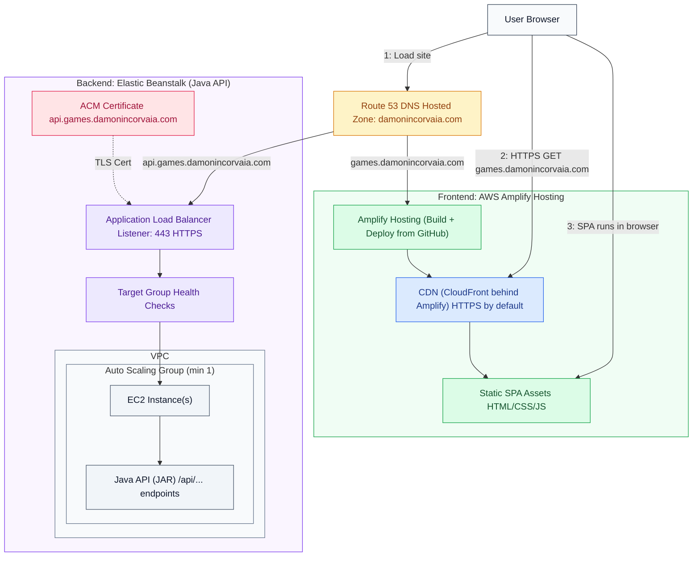

## AWS Architecture Diagram

```mermaid
flowchart TB
  %% =========================
  %% Clients
  %% =========================
  U[User Browser]:::client

  %% =========================
  %% DNS
  %% =========================
  R53["Route 53 DNS Hosted Zone: damonincorvaia.com"]:::dns

  %% =========================
  %% Frontend (Amplify)
  %% =========================
  subgraph FE["Frontend: AWS Amplify Hosting"]
    A["Amplify Hosting (Build + Deploy from GitHub)"]:::frontend
    CF["CDN (CloudFront behind Amplify) HTTPS by default"]:::cdn
    S["Static SPA Assets HTML/CSS/JS"]:::frontend
    A --> CF --> S
  end

  %% =========================
  %% Backend (Beanstalk + ALB)
  %% =========================
  subgraph BE["Backend: Elastic Beanstalk (Java API)"]
    ALB["Application Load Balancer Listener: 443 HTTPS"]:::alb
    ACM["ACM Certificate api.games.damonincorvaia.com"]:::acm
    TG["Target Group Health Checks"]:::alb
    subgraph VPC["VPC"]
      subgraph ASG["Auto Scaling Group (min 1)"]
        EC2["EC2 Instance(s)"]:::compute
        APP["Java API (JAR) /api/... endpoints"]:::compute
        EC2 --> APP
      end
    end
    ALB --> TG --> EC2
    ACM -. TLS Cert .-> ALB
  end

  %% =========================
  %% DNS routing
  %% =========================
  R53 -->|games.damonincorvaia.com| A
  R53 -->|api.games.damonincorvaia.com| ALB

  %% =========================
  %% User flows
  %% =========================
  U -->|1: Load site| R53
  U -->|2: HTTPS GET games.damonincorvaia.com| CF
  U -->|3: SPA runs in browser| S

  %% =========================
  %% Styles
  %% =========================
  classDef client  fill:#F8FAFC,stroke:#334155,stroke-width:1px,color:#0F172A;
  classDef dns     fill:#FEF3C7,stroke:#D97706,stroke-width:1px,color:#92400E;
  classDef frontend fill:#DCFCE7,stroke:#16A34A,stroke-width:1px,color:#14532D;
  classDef cdn     fill:#DBEAFE,stroke:#2563EB,stroke-width:1px,color:#1E3A8A;
  classDef alb     fill:#EDE9FE,stroke:#7C3AED,stroke-width:1px,color:#4C1D95;
  classDef acm     fill:#FFE4E6,stroke:#E11D48,stroke-width:1px,color:#9F1239;
  classDef compute fill:#F1F5F9,stroke:#475569,stroke-width:1px,color:#0F172A;

  %% Optional: tint the big containers slightly (works in most Mermaid renderers)
  style FE fill:#F0FDF4,stroke:#16A34A,stroke-width:1px
  style BE fill:#FAF5FF,stroke:#7C3AED,stroke-width:1px
  style VPC fill:#F8FAFC,stroke:#64748B,stroke-width:1px
  style ASG fill:#F8FAFC,stroke:#64748B,stroke-width:1px
```